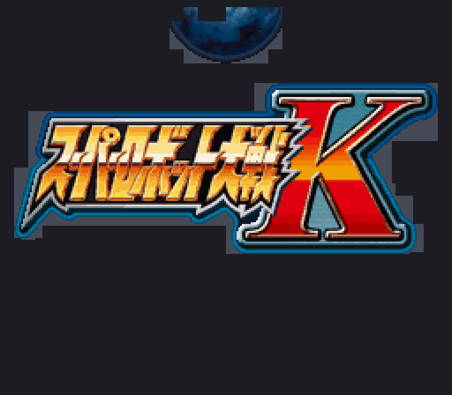

# 타이틀 로고 편집용 에셋 (원본 일본어 로고)

슈퍼로봇대전 K 타이틀 로고 「スーパーロボット大戦K」의 **원본 이미지**를 직접 편집할 수 있는 PNG 캔버스입니다.
로고는 BG 이미지가 아니라 **OBJ 스프라이트 + 영역별 16색 팔레트**로 그려지므로,
아래 규칙을 지켜 편집하면 게임에 그대로 반영됩니다.



## 파일
| 파일 | 설명 |
|---|---|
| `title_logo_canvas.png` (256×224) | **편집 대상**(원본 로고). 화면과 1:1 — 픽셀 (x,y) = 게임 화면 좌표 |
| `title_logo_canvas_x4.png` (1024×896) | 같은 그림 4배 (편집 편의용, import가 자동 축소) |
| `title_logo_guide.png` | 편집 가능 영역(밝은 회색 = 스프라이트가 덮는 곳) |

둘 중 **하나만** 편집해서 저장하세요.

## 편집 규칙 (게임 구조상 제약)
1. **표시 영역** — 가이드의 밝은 회색(스프라이트가 덮는 영역) 안에서만 게임에 표시됩니다. 그 밖에 그려도 나오지 않습니다.
2. **색 제약(16색 팔레트)** — 각 영역은 정해진 16색만 쓸 수 있어, import 때 **가장 가까운 팔레트 색**으로 맞춰집니다. 잘 나오는 계열: 글자 = 금색/네이비/어두운색, K = 빨강·주황, 외곽 프레임 = 파랑·은색.
3. **투명/지우기** — 알파 0 = 투명(배경이 비침), 알파 ≥ 50% = 칠해짐.
4. **크기 유지** — 256×224 또는 1024×896 그대로 저장(다른 크기면 자동 리사이즈되어 위치가 어긋날 수 있음).

편집하지 않은 픽셀은 **픽셀 단위로 보존**됩니다(display-lossless 검증 완료). 편집한 부분만 각 영역 팔레트에 맞춰 반영됩니다.

## 추출 / 되돌리기(주입)
> 전제: 타이틀 화면의 DeSmuME 세이브스테이트에서 뽑은 `_sstate.bin`(OAM) · `_vram.bin`(OBJ 타일) · `_pal.bin`(팔레트)이 작업 폴더에 있어야 합니다(저작권상 저장소에는 미포함).

```bash
# 추출: 원본 로고 -> PNG 캔버스   (인자 'current'를 주면 한글 패치 버전으로 추출)
python tools/_export_png.py

# 편집한 PNG -> 타일로 되돌리기 -> ROM   (기본 base = 원본 일본어 타일, 캔버스와 일치)
python tools/_import_png.py title_logo/title_logo_canvas.png   # -> _fg_new.bin (display-lossless)
python tools/_inject_title3.py                                 # -> kr/add02_patched.bin (#2360 원본 슬롯 크기로 0패딩)
python tools/build_rom_all.py                                  # -> 패치 ROM
```

> **중요**: add02 블록은 정렬·패딩 없이 타이트하게 패킹되고 게임이 블록 오프셋을 캐싱하므로, 재인코딩 블록은 반드시 **원본 슬롯과 동일한 크기로 패딩**해야 합니다(`_inject_title3.py`가 처리). 안 그러면 뒤 블록이 밀려 타이틀 배경 등 다른 이미지가 전부 깨집니다.
